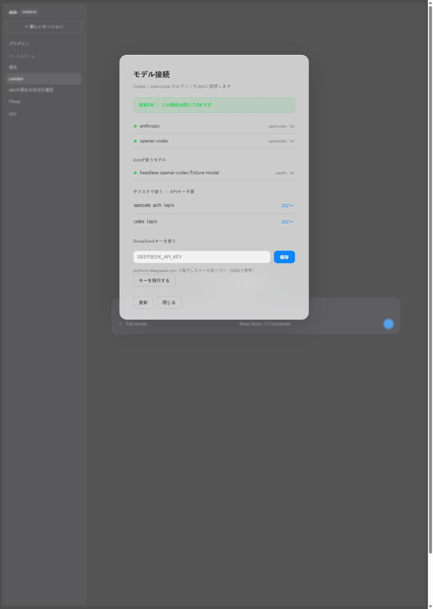

# Credential sharing example

These captures use actual release builds of rdsh setup --web, before the change
(main 9f2b940) and after it, with identical isolated Codex/OpenCode fixtures.
All keys and OAuth grants are test-only; no real provider request was made.
The screenshots show the real Rust HTTP server and browser UI.

## Before

auth --import copies both providers and Codex's separate API-key ref:

```text
import llm-pi-ai/anthropic from opencode
import llm-pi-ai/openai-codex from opencode
import ref OPENAI_API_KEY from codex
```



## After

auth --import without a selection exits 1 and writes no credentials:

```text
[rdsh] error: no credential sharing selected; preview rdsh auth, then use --select SOURCE:CREDENTIAL --import
```

Choosing only opencode:openai-codex with --select and --import copies one grant.
The other provider, Codex's OAuth and its separate API-key ref are not copied.
The supplied environment key remains a nonpersistent reference.

```text
import llm-pi-ai/openai-codex from opencode
```


The machine-readable [CLI result](auth-sharing-cli.json) was captured from both
builds using the same fixture input. Screen state distinguishes credential
presence from successful authentication and explains persistent scope and
separate unselect, saved-copy removal and provider revocation.
