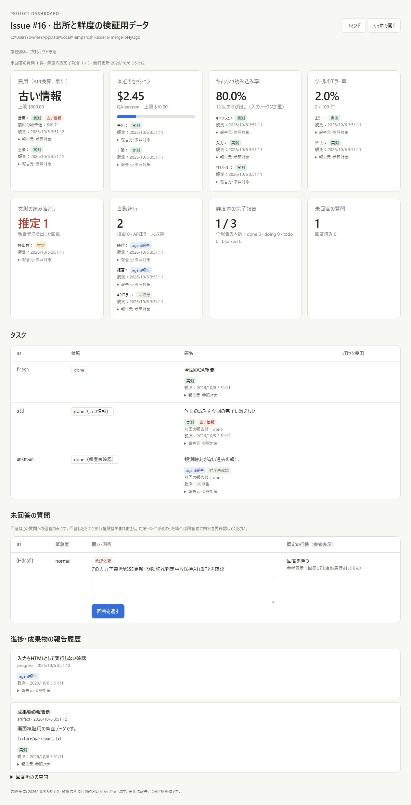

# Metric freshness and main integration evidence

Issue: [#16](https://github.com/sahenjp/rustdsh/issues/16).
PR: [#90](https://github.com/sahenjp/rustdsh/pull/90).
Captured on 2026-10-06 JST after integrating main
`190dd7ce60ec051cdc5e52cd15950b182f820baa`.

## Before and after

Both screenshots are actual browser captures with the same synthetic project
reports. The before server loads the tracked dashboard modules from the main
commit above. The after server runs this PR. Each server has its own temporary
state, loopback port and credentials, with Tailscale disabled.

| Main before | This PR after |
| --- | --- |
|  |  |

A day-old $90.71 cost changes from a current numeric card to an old report with
its observation time. Three `done` reports change to one fresh completion report:
the other two are old or have no observation time. The overview uses the same
freshness rule as the detailed cards.

## Updates and interaction

The three captured steps are [initial](metric-freshness-frame-1.png),
[partial update](metric-freshness-frame-2.png) and
[idle expiry](metric-freshness-frame-3.png). A fresh cache report initially shows
80.0%. Updating only the cached counter changes the ratio to `比較不可`, since
the numerator and denominator no longer belong to one snapshot. The new report
has an eight-second lifetime; the next periodic check, without another state
update, shows `古い情報`. None of these updates refreshes the old cost.

At each step the unsent answer draft, textarea focus and expanded source details
remain intact. The latest main's command palette opens and closes correctly.
All four provenance labels render. A source containing an HTML image tag remains
text, with zero images inserted in the event feed. Browser error/warning logs
are empty. The 1280px viewport has document width 1265px and no horizontal overflow.

## Validation

- Windows Node 24.18.0: `npm ci && npm test`, 18 tests passed, none skipped.
- WSL: `cargo fmt --check`, release clippy with warnings denied, release tests
  (62 passed), release build and `tests/regress.sh` (41 checks passed).
- JavaScript syntax and Git whitespace checks passed.

These captures verify local rendering and interaction using declared reports.
They do not establish independent provider measurements, acceptance approval,
physical-phone/Tailscale access or Production adoption. The unrelated local
Windows setup files are outside this change.
